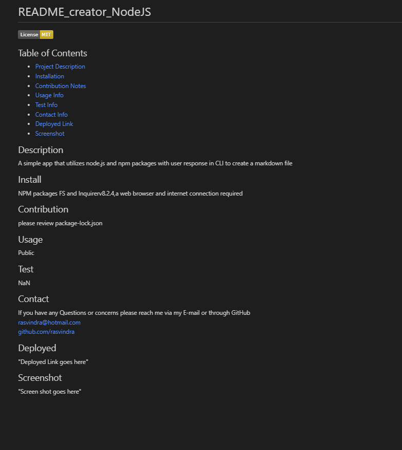

    
# README_creator_NodeJS

## Table of Contents
* [Project Description](#description)
* [Installation](#install)
* [Contribution Notes](#contribution)
* [Usage Info](#usage)
* [Test Info](#test)
* [Contact Info](#contact)
* [Deployed Link](#deployed)
* [Screenshot](#screenshot)

## Description
A simple app that utilizes node.js and npm packages with user response in CLI to create a markdown file

## Install
NPM packages FS and Inquirerv8.2.4,a web browser and internet connection required

## Contribution
please review package-lock.json

## Usage
Public

## Test
NaN

## Contact
If you have any Questions or concerns please reach me via my E-mail or through GitHub  
rasvindra@hotmail.com  
[github.com/rasvindra](https://github.com/rasvindra)

## Deployed
https://youtu.be/3xt4FYKiCmg

## Screenshot

